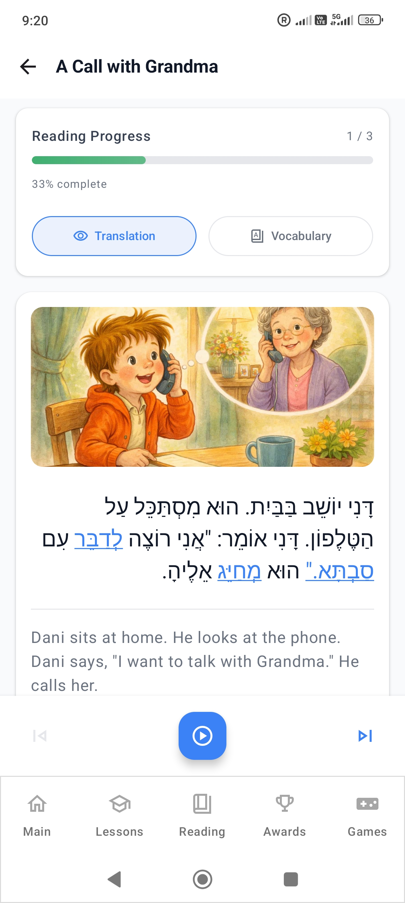

There are three people making decisions inside the app project, according to its creator: a teacher, an indie developer, and a product owner who has to think about marketing. They happen to be the same person. They also tend to disagree.

The developer can see something interesting to build. The product owner can see something that might persuade a learner to stay. The teacher asks a less convenient question: will this actually teach anything?

So far, the teacher generally wins.

That tension explains a lot about **Learn Hebrew – Read & Speak**, the app behind HebrewEdu. It began almost five years before the founder interview as a tool for learning the Hebrew alphabet. It has since grown into a broader learning system, but the original question still guides it: how do you help someone understand Hebrew well enough to begin working without your help?

*This article draws on a founder interview conducted in Russian. Short quotations below are editorial English translations; the rest is paraphrased from the interview.*

## A phrase you remember, or a word you can recognize?

The founder's objection to starting Hebrew with ready-made phrases is quite practical. Imagine learning to say *Shalom! Shemi Victor…* from a line of Latin transcription. You can repeat a greeting and introduce yourself. That is useful, and the pleasure of saying something new is real.

But what happens when the transcription disappears? Can you recognize the greeting in Hebrew script? Find the word in a text? Read it on a sign? Or have you learned a sequence of sounds that remains disconnected from the written language?

For someone learning a language in an already familiar script, beginning with phrases may leave fewer obstacles. For a Hebrew beginner who cannot yet recognize the letters, it can leave the foundation untouched.

The founder describes the distinction this way:

> “There is a big difference between knowing and understanding.”

Here, knowing means being able to reproduce something you have memorized. Understanding means beginning to see how it works: recognizing the letters, connecting them to sounds, and using that knowledge in another word. Both matter, but they are different kinds of progress.

His aim is to move the learner beyond the excitement of having remembered a phrase toward the quieter satisfaction of being able to work something out. That is why the app began with the Aleph Bet rather than a collection of things to say on holiday.

## An alphabet lesson has to earn its examples

The original ambition was modest: build a better Hebrew alphabet learning tool. A learner could use it to establish the basics, then continue with an ulpan, a teacher, a textbook, or another course.

The project's original working name, **Alef-Bet Tutor**, accurately described that first purpose. As Nikud, reading, grammar, vocabulary, verbs, and Trainer Hub expanded its scope, the public app-store positioning broadened too. Its current Google Play title, **Learn Hebrew – Read & Speak**, reflects how far the product has grown beyond its alphabet beginnings.

But a good alphabet tool needed more than a grid of letters. The founder imposed a rule on the lessons: an example should not contain letters the learner has not yet studied.

That sounds obvious until you try writing the material. A familiar, useful word may be a poor example if half its letters are still unknown. The teaching sequence limits the vocabulary available to the author. The lesson has to be designed around the learner's current knowledge rather than the author's wish to show an appealing word.

At the beginning, with only Alef introduced, there is effectively no meaningful word example available under that rule. Once Bet joins it, something as simple as <bdi lang="he" dir="rtl">אבא</bdi> — *aba*, “dad” — becomes possible. The letters are familiar; their combination is new. Vowel marks and reading rules still need their own explanation, but the learner is no longer being asked to decipher unfamiliar letter shapes at the same time.

The important part is the constraint: **new material should build on what the learner can already recognize**.

An early example does not need to be impressive. It needs to be readable. Even a small word can change the experience from copying an answer to recognizing why the answer makes sense.

Readers looking for the letters themselves can use the [complete Hebrew alphabet guide](/blog/hebrew-alphabet-complete-guide/). The story here is about why the app introduces them in a controlled sequence, and what that sequence makes possible next.

## The question that made the app grow

An alphabet trainer has a natural stopping point: the learner knows the letters. The founder eventually found that stopping point unsatisfying. What happens next?

The alphabet material became more substantial. Individual letters received explanations, theory, examples, and practice. Quizzes asked learners to demonstrate knowledge before progressing. Looking at a lesson and understanding it in the moment were no longer treated as enough on their own.

Still, a second gap remained. Recognizing letters does not automatically mean being able to read Hebrew. A learner can name every shape on the screen and struggle to combine those shapes into a word.

“From the letter to the word” became a useful expression of the teaching approach. A letter connects to a sound; familiar elements combine into words; reading rules make those combinations more intelligible; simple texts give them a purpose. Broader language understanding develops as vocabulary and grammar join the process.

This is gradual progression, not a claim that every learner must finish one entire subject before touching another. A teacher or course may introduce conversation alongside reading. Within the app, however, the next explanation should have something solid to stand on.

That question — what can the learner do next? — pushed the app beyond its original alphabet-only role.

## Nikud is a bridge, and it takes work

Hebrew vowel marks occupy an awkward place for beginners. They are not letters of the alphabet, yet they are essential to much beginner reading. Knowing the consonant letters leaves a learner with another system to understand: the dots and dashes called Nikud.

The founder does not describe this as an effortless stage. Learning to notice a small mark, connect it to a sound, and read it together with a letter takes practice. Dedicated Nikud material and reading rules grew out of that difficulty.

The app's current teaching texts contain Nikud. This gives beginners pronunciation support while they are still building their knowledge of Hebrew words. It does not solve reading by itself. A learner must still connect the word to a meaning, recognize it again, and learn how it behaves in a sentence.

Vocabulary gradually changes the experience. A word that once demanded close inspection starts to look familiar. More words become recognizable, and less attention goes into assembling every sound from scratch. Readers who need the vowel system explained can turn to the [beginner's guide to Hebrew Nikud](/blog/how-to-read-hebrew-nikud/); those approaching ordinary unvoweled text can read about [learning to read Hebrew without vowels](/blog/why-hebrew-without-vowels-looks-impossible-until-your-brain-adapts/).

The founder has considered allowing more advanced learners to hide Nikud in the reading section. **That is a possible future direction, not a feature available today.** For now, the learning texts keep their vowel marks.

## Reading is where the separate pieces meet

Asked which part of the product he was most proud of, the founder singled out the reading section.

It is an understandable choice. An alphabet exercise can establish recognition. A short text asks the learner to put recognition to work while following something with meaning. Letters, vowel marks, vocabulary, and sentence structure stop being separate topics for a moment.

The app's reading section offers beginner-friendly texts with translation options, vocabulary help, and pronunciation/audio support. Those tools address different problems. You may be able to sound out a word without knowing its meaning. You may understand a sentence after reading the translation but still need to hear how its words sound together.

<figure class="article-screenshot">

<figcaption>A beginner story brings Hebrew script, meaning, and audio into the same reading session.</figcaption>
</figure>

Support matters because struggling with every element at once can make even a short text exhausting. The intention is to let a beginner stay with the reading rather than abandon it whenever one word causes difficulty.

There is also a useful distinction for the learner to keep in mind: following a translation is not the same as understanding the Hebrew independently. After using help, return to the Hebrew line. See which words you can now recognize and which still need work. The site's article on [why reading Hebrew and understanding it can develop at different speeds](/blog/why-you-can-read-hebrew-but-still-understand-absolutely-nothing/) explores that gap more fully.

The reading section represents a significant change in the product's purpose. The app no longer simply prepares someone to go elsewhere and read. It gives them a supported place to begin.

## Beyond “how do I say this?”

Premium users can access AI-assisted phonetic and reading analysis for individual words. The founder's interest in it is tied to a specific teaching problem rather than the novelty of AI.

Audio can tell you how a word sounds. Transcription can give you a Latin-script approximation. But a learner may still be left wondering why those Hebrew letters and marks produce that pronunciation.

Word analysis attempts to explain the connection: how the letters, vowel marks, and reading rules work together. The educational value lies in that explanation. Ideally, the learner encounters a pattern in one word and begins recognizing it in another.

This is a teaching aim, not a guarantee that an AI explanation is always accurate or complete. An uncertain explanation still needs checking against lesson material or with a teacher. The tool should help the learner reason about reading rather than become an authority they must accept without question.

The founder puts the longer-term goal plainly:

> “The ideal result of any textbook is when the learner no longer needs it.”

First you ask for an explanation. Later you recognize part of the pattern before asking. Eventually you can work through more words yourself. The support has done its job when some of the work it once performed becomes your own skill.

## Transcription can help without becoming the foundation

The founder is not against transcription. A temporary aid can make a new sound less mysterious or help someone check what they have just read.

His objection is to using it as the foundation of Hebrew teaching. If every new word arrives primarily in Latin letters, a learner can keep getting better at reading the transcription while remaining unable to recognize the Hebrew.

A practical question is whether the support is helping you return to the script. Can you look back at the Hebrew word and connect its written form to the sound? Can you recognize it when it appears again without a transcription underneath?

You do not have to remove all assistance immediately. The aim is to reduce dependence as recognition develops. A crutch can be useful while you need it; it should help you move toward doing more on your own.

That principle connects transcription to the reading section and word analysis. None of them is intended to be a permanent substitute for engaging with Hebrew itself.

## Grammar, verbs, and a place for play

Once learners begin reading, their questions expand. Why does this form change? How do these words fit together? What happened to the verb?

The app now includes a growing grammar curriculum. For its creator, presenting grammar in an app has required substantial thought: an explanation can be correct and still be too dry or difficult to read on a phone. Lessons include examples, vocabulary, early dialogues, and practice alongside the theory, giving the learner ways to use an explanation.

The curriculum is still being expanded. The founder sees the possibility of eventually developing a foundation that could support roughly A2 beginner competence. **That is an ambition for the curriculum, not a validated claim that the current app delivers or guarantees A2.**

Verb materials extend the same concern with understanding patterns. Roots, conjugated forms, and binyan reference and practice help learners investigate an area that often becomes frustrating. Different learners will need these tools at different times. Someone accompanying an ulpan may open the verb reference while another learner is still working through vowel marks. The site's [introduction to Hebrew binyanim](/blog/hebrew-binyanim-explained/) explains the underlying idea without requiring the app.

Vocabulary review and spaced repetition provide another kind of continuity: returning to words that need more attention. Dictionary functionality supports looking things up as questions arise. Core learning functionality is also available offline, so study can continue when a connection is unavailable.

Then there is Trainer Hub, where foundational skills such as letter recognition, basic words, and Nikud can be practiced in a more playful form.

This is one place where the founder's three roles have to negotiate. The teacher wants meaningful practice. The developer can build interactions. The product owner knows that serious study competes for attention with experiences that offer faster gratification.

His compromise is to use gameplay to practice knowledge. Rewards should encourage the activity rather than become its entire purpose. For browser-based practice, the website's [Play section](/play/) offers a separate place to try Hebrew learning games; it is not the app's Trainer Hub.

## What the app leaves to people, paper, and other resources

The product name includes “Speak,” but its creator does not believe an app can fully replace human communication. To develop spoken language, you have to speak with people.

An app can support that work through vocabulary, grammar, reading, and listening to audio. It cannot make a real conversation happen simply because you have completed its exercises. A teacher, an ulpan, a conversation partner, or another opportunity to use Hebrew remains important.

Handwriting is another deliberate boundary. The app focuses on printed Hebrew and does not teach handwriting or calligraphy. The founder does not regard tracing a letter on a touchscreen as equivalent to learning to write it. For handwriting practice, his advice is straightforward: take paper, take a pen, and write.

There is no universal textbook that serves every learner and every skill equally well. A motivated learner will usually combine resources.

The app can provide a learning system for significant parts of beginner Hebrew, serve as a companion to a course, or become a focused reading trainer or verb reference. Those are different uses of the same product. The [homepage's product overview](/) shows how its main learning areas fit together.

Its best fit is a beginner who wants to learn seriously, whether independently or with other support. Someone who only wants a few travel phrases may reasonably prefer a simpler, phrase-oriented tool. The founder is comfortable with that. The product does not have to suit every purpose.

## What to look for after a month of study

A month is a measure of elapsed time. It tells you little about what happened inside it.

The founder values discipline and consistency more than rapidly collecting completed-lesson labels. Rushing through explanations may produce an attractive progress screen while leaving recognition and reading uncertain.

His practical estimate is that a diligent beginner can often work through the alphabet in about seven to ten days with consistent study. That is an observation, not a universal timetable or a promise of fluent reading. Getting through alphabet material and becoming comfortable using it are different milestones.

For a beginner wondering whether study is working, more useful questions are:

- Can I recognize the printed letters, including their final forms?
- Am I becoming comfortable reading from right to left?
- Can I use basic Nikud to read elementary vocalized Hebrew?
- Am I learning new words in Hebrew script and recognizing them again?
- Am I spending focused time studying, and gradually needing less transcription?

These questions reveal something a lesson count cannot. They also suggest what to practice next. If the letters are familiar but simple reading is still difficult, spend time combining them with vowel marks. If pronunciation is becoming easier but meaning is missing, give vocabulary more attention.

Start with the alphabet, then gradually add words, Nikud, simple reading, vocabulary growth, and grammar. Keep the work consistent. You do not need to turn every session into a test, but occasionally checking what you can do without help makes progress more visible.

When someone finds Hebrew intimidating, the founder first wants to know why they want to learn it. Motivation gives the effort a purpose. The script may initially look like incomprehensible symbols; studying the alphabet begins turning those symbols into a system. Nikud takes more work, and growing vocabulary makes more of the language recognizable over time.

## The screen time should have been worth it

Almost five years of making an app brings praise, criticism, suggestions, bug reports, and occasional complaints that are difficult to do much with. The founder accepts that mixture as part of building a product.

What stays with him most positively is direct support email. Some users in Israel have written to thank him for helping people learn Hebrew; some religious users have sent blessings. These are the kinds of messages he described in the interview, rather than testimonials reproduced here. They matter because they suggest the teaching is reaching someone beyond the screen.

At the time of the interview, he reported a little over 3,000 active users. Reaching at least 10,000 globally is a longer-term ambition. Neither number tells the whole story of whether a learner's time was well spent.

The deeper goal is what happens when someone finishes the final lesson. He wants them to feel that the screen time was worthwhile: that they can recognize more, understand more, and begin doing things that previously required help.

That is the thread connecting the original alphabet trainer to the broader app. Memorizing something can be a beginning. Recognizing it is another step. Understanding why it works opens the possibility of using that knowledge elsewhere.

And when a learner starts doing more without the tool, the teaching idea has reached its purpose. The way forward is to keep taking those steps.
