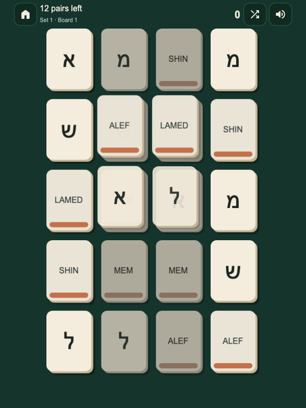

“Dad, now I’ll be able to read Hebrew.”

After playing Hebrew Mahjong with his father, HebrewEdu’s founder, the nine-year-old was excited about what he had learned. He could not actually read Hebrew yet and did not know the Nikud vowel system. But later, when his father showed him <bdi lang="he" dir="rtl">שלום</bdi>, he recognized letters he had met in the game, including <bdi lang="he" dir="rtl">ש</bdi> and <bdi lang="he" dir="rtl">ל</bdi>.

That is a smaller result than “a game taught a child to read Hebrew.” It is also a more interesting one. Shapes that had been unfamiliar were now recognizable in a word, away from the board where he had practiced them.

One family’s experience cannot establish how well a game teaches other learners. It can, however, suggest a useful question: **what remains when the game is gone?**

A level completed inside an interface is evidence that someone can complete that level. Whether they can recognize the same language somewhere else is another question. The distinction became the center of a founder interview about the teaching philosophy behind HebrewEdu Play.

*The interview was conducted in Russian. The opening recollection and short founder quotations are editorial English translations. The design principles and observations are his pedagogical position, not a claim of scientifically established effectiveness.*

## The result should appear after the game

For an alphabet game, the outside test can be modest. Can the learner find a familiar letter in a word? Recognize it on a sign, in a different interface, or in a line of text?

For vocabulary, the question changes. Can they understand a word without the particular picture that always accompanied it? For phrases, can they choose an appropriate response when the situation changes?

This is what the founder means by **transferability**: the practiced skill survives a change of setting. Getting better at a game matters when the improvement includes something the learner can take elsewhere.

A learner might instead become excellent at remembering where an answer appears on the screen. Or learn that a certain illustration always goes with the second option. Those strategies can produce an impressive score while leaving the language largely untouched.

The son’s recognition of letters in <bdi lang="he" dir="rtl">שלום</bdi> was a small example of transfer, not a demonstration of reading competence. Naming a letter, connecting it to a sound, combining sounds, and understanding a word remain distinct tasks. The [Hebrew alphabet guide](/blog/hebrew-alphabet-complete-guide/) and [Nikud guide](/blog/how-to-read-hebrew-nikud/) cover foundations that a matching game does not replace.

## Games are instruments; someone still has to conduct

The founder’s orchestra metaphor gives games a useful place. A textbook, an app, and a game are instruments. A teacher can act as the conductor, deciding when each belongs in the learning process and how the parts fit together.

In his view, owning several tools does not automatically produce a coherent course of study.

A game may introduce material. It may reinforce a lesson, offer repetition, or make independent practice easier. But practicing letter recognition does not cover everything a beginner needs to read, listen, understand, or speak.

The question for a learner or teacher is therefore specific: what work is this game doing today? If the answer is “revisiting a few letters before reading,” the game has a clear job. If the answer is “learning Hebrew,” the promise is too broad to evaluate.

## Where does the player’s attention go?

The founder is skeptical of treasure chests, flashing gems, coins, and elaborate reward sequences when they become the main reason to interact. His objection is about where attention goes.

A beautiful board can make letters pleasant to examine. A short sound can confirm a match. An animation can make the consequence of an answer clear. Those choices serve the activity.

But imagine a player whose clearest memory is the chest opening after five answers. Did the letter receive sustained attention, or was it an obstacle on the way to the chest? If the player cares mostly about a new skin, the reward system may be succeeding on its own terms while the educational task receives very little thought.

Adding rewards to an exercise is often called gamification. Building a game around a learning action is a different design challenge. Neither label settles the question. Look at what the player repeatedly notices, decides, and does.

A useful test is to ask what would happen if the language disappeared. If essentially the same satisfying game remained, with arbitrary tapping in place of recognition, the learning mechanic may be peripheral.

The founder wants rewards to bring attention back to the language. He does not want language to become the toll paid to reach the rewards.

## Fun has a job, too

There is another way to fail: build a perfectly respectable exercise that nobody wants to repeat.

The founder sees two bad extremes. One is the dry trainer, demanding enough motivation that only the most determined learner keeps returning. The other is empty entertainment, where the language occupies a small corner of a much more compelling reward loop.

His middle ground is that enjoyment should come from doing the learning action successfully. Recognizing a letter enables a satisfying choice. Finding the right pair clears part of the board. The pleasure and the practice happen close together.

Fun, in this view, fuels regularity. An activity that looks efficient on paper may provide little practice if the learner abandons it. A less austere activity may be more useful if someone willingly returns and continues paying attention to the material.

The aim is not to entertain between exercises. It is to make the exercise itself worth returning to.

## The game action should match the learning action

During the interview, the founder revised one of his own rules.

The earlier version said language should always function as a tool inside a game rather than become the target. For vocabulary, that can be a productive challenge: perhaps a character asks for something, and the player needs the word to choose what to give them.

But the rule was too rigid for letters. If the goal is to recognize a new symbol and associate it correctly, recognition is already meaningful work. Inventing a complicated role-playing scenario around Alef could make the interface harder without improving the task.

He accepted that objection. The revised principle was simpler:

> “The game action should match the learning action.”

For letters, that action may be recognition. For words, it may be identifying meaning from context or choosing an object or action. For phrases, it may be constructing a message or reacting appropriately to a situation.

This guards against two different mistakes. A simple learning target can disappear beneath unnecessary game complexity. A complex target can be reduced to a quiz that never asks the learner to perform the skill they actually need.

### Two alphabet games, two ways to practice recognition

[Alef Bet Rush](/play/alef-bet-rush/) is, at its core, a recognition quiz. The learner encounters material first, then identifies the correct Hebrew letter among alternatives. Its planets and groups of letters give the sequence a narrative wrapper: there is somewhere to go next in the Aleph-Bet universe.

The educational action remains recognizable beneath that theme. Progress requires identifying letters. The space setting gives the exercise continuity without requiring an invented practical use for every symbol.

[Hebrew Mahjong](/play/hebrew-mahjong/) approaches recognition through matching. A pair connects a Hebrew letter to its name rather than joining two identical pictures. The learner repeatedly recognizes, matches, hears, and confirms.

<figure class="article-screenshot">

<figcaption>The first Mahjong set keeps the material limited. A pair joins a letter to its name, so clearing the board requires more than spotting identical shapes.</figcaption>
</figure>

Finding a pair and clearing the board provide satisfaction near the learning action. Sound design and tactile or haptic feedback, where available, contribute to that feeling. They do not need to become a separate spectacle after the language work is finished.

The two mechanics are different, but both ask for the skill they intend to practice. Neither should be mistaken for a complete reading lesson.

## One new thing is enough to organize around

Hebrew Mahjong introduces a limited set of letters rather than confronting the beginner with the entire alphabet at once. The founder wants the learner to spend effort recognizing the material, not remembering what the interface is asking them to do.

He calls the broader design constraint **One New Thing**. At a given moment, one genuinely new element should receive most of the learner’s attention; familiar elements should support it.

His working rule forces a designer to name what is new. Is it the letter? The matching rule? The board layout? The audio prompt? If all four change together, an incorrect answer becomes difficult to interpret.

The rule does not require an empty screen. Mahjong still has a board puzzle. The question is whether the surrounding demands are understandable enough to leave room for the language task.

For someone choosing a game, the same question is practical: am I struggling with the Hebrew, or with working out how to operate this thing?

## A mistake should point to the next practice

Both current games provide immediate correction. A wrong answer should reveal the correct model, with audio where useful, so that the learner has something better to try next.

An earlier version of Alef Bet Rush also collected mistakes into a final report showing which letters needed work. The founder removed that report because it made the experience feel too much like an academic test.

That decision does not mean mistakes should be ignored. His preferred use of an error is as an internal signal: show the difficult material again, without making a public inventory of failure. Hebrew Mahjong already brings difficult letters back more often.

The intended sequence is **error, feedback, correct model, more practice**. Merely deducting points leaves out the part that makes the next attempt educational.

The games currently differ in how they handle progression. Alef Bet Rush has lives; mistakes can require another attempt before progression. Hebrew Mahjong has no lives. Mistakes affect the final one-, two-, or three-star rating instead.

The founder does not personally read the loss of a heart as a harsh punishment. Having grown up with platform games such as Mario, he associates lives with another try. But that intention alone cannot determine how a learner experiences them. A retry needs to remain approachable and useful, rather than trap someone in repeated guessing.

His son could usually finish levels after a second or third attempt despite starting without Hebrew. That is an observation about one child, not a performance promise.

During the interview, the founder considered a life-and-repetition mechanism for future Mahjong versions or other games. It is a design possibility, not a feature currently in Hebrew Mahjong. The question would be whether the mechanism creates helpful extra practice, rather than simply delaying progress.

## Help should eventually become unnecessary

Images, sound, text, and simple alternatives can give a beginner somewhere to start. The founder calls these supports scaffolding.

But permanent support can conceal what the learner knows. Someone may recognize the picture reliably without recognizing the word. If every prompt uses the same layout and context, success may depend on those cues.

For future vocabulary game design, the interview developed four phases of **fading scaffolding**. They are a proposed framework, not a system already implemented across HebrewEdu’s alphabet games.

### 1. Full support: establish what the item means

Introduce a word with an image, sound, text, and a simple choice. Make the first encounter understandable without asking the learner to solve several unfamiliar problems at once. This is where support earns its place.

### 2. Channel isolation: change which help is available

Remove one support channel. Keep sound and text but take away the image, for example. Or play the sound and ask the learner to choose among images without a written word.

Does recognition survive when a familiar cue disappears? Changing the available support can reveal which association needs practice.

### 3. Context shift: let the word travel

If “water” first appears in “I want water,” later encounter it in “cold water” or “Where is the water?”

The word must survive beyond its original phrase. This connects to [learning Hebrew vocabulary in context](/blog/how-to-learn-hebrew-vocabulary/): a game should change the surroundings while keeping the meaning recognizable.

### 4. Contrastive pressure: make the alternatives meaningful

Choosing “water” over “dog” and “table” may be possible with only a vague sense of the category. Choosing among “water,” “juice,” and “milk” asks for a more precise distinction.

Plausible alternatives should sharpen the distinction, without turning the task into a trick question. Together, these phases move toward recognition with less help and in new surroundings.

### When should a support disappear?

The founder would prefer to look at behavior rather than remove help because a timer expired. Possible signals include several consecutive correct answers, shorter response times, and fewer repeated changes of option before answering.

These are practical design signals, not direct measurements of understanding. A fast answer can be a guess. A slow one may reflect a distraction or an unfamiliar control. A support system would need to consider the pattern and remain willing to offer help again.

Support should fade as the learner becomes ready to work independently.

## Calm practice can still be dense practice

The founder deliberately avoided visible timer pressure in the current alphabet learning context. He feels modern life already contains enough demands to hurry; unfamiliar letters deserve time to examine.

Time pressure may suit a future mechanic. For now, Alef Bet Rush can change pace without turning beginner recognition into a countdown test.

He distinguishes **practice density** from speed. Practice density asks how much of a session involves meaningful language actions. Speed asks how quickly the learner answers. You can improve the first without demanding the second.

Unnecessary menus, long victory animations, repeated “Great job!” screens, and clicks that perform no learning action consume time between useful decisions. Removing them can let someone think calmly about each letter while still making many meaningful choices in a few minutes.

His principles of minimal interface friction and pacing without pressure fit together here. Let the learner think. Once they answer and receive useful feedback, let the next meaningful interaction arrive smoothly.

## A few minutes can refresh knowledge; they cannot replace a course

Digital is not automatically better in the founder’s view. With younger children, he personally prefers verbal and visual interaction in the real world rather than introducing a phone too early.

The phone’s practical advantage is availability. On a bus, in a queue, or in a waiting room, a learner may have time to revisit a few familiar items without carrying physical flashcards.

Those pockets of time can have a modest, clear purpose: refresh a letter, revisit a word, or bring previously studied material back into use. The founder rejects “learn a language in two minutes a day” as a complete methodology.

A short session belongs alongside more substantial study. Its value depends on what happens inside those minutes and how that practice connects to the learner’s other work.

## Sometimes the next useful action is to stop

If learning is the objective, keeping someone inside the game for as long as possible is an incomplete measure of success.

The founder takes that thought further:

> “A good educational game should sometimes tell the player: enough for today.”

He imagines a game encouraging a break after meaningful progress, then inviting the learner to return another day for familiar material and something new. That stopping prompt remains a future design idea.

The principle is more immediate: a design should be allowed to protect attention and acknowledge fatigue. Another round is not automatically the best choice simply because the player can be persuaded to start it.

There is a real tension here. The product owner wants people to return. The teacher wants their time to serve a purpose. The founder’s position is that returning should mean another useful encounter with the language, rather than maintaining a reward loop at any cost.

## Vocabulary needs more than a prettier translation quiz

Recognition is an appropriate target for an alphabet game. It does not follow that every later skill should use the same quiz.

For vocabulary, the founder wants to explore situations where meaning enables an action: giving a character the requested item, choosing what to do, or using an object appropriately. Contrastive choices can require distinctions among nearby meanings. Building a phrase from components can place a word in a grammatical and logical role.

For phrases, selecting a response to a situation may be more relevant than identifying a memorized translation. Constructing a message may require a different mechanic again.

These are directions for future design, not descriptions of released vocabulary systems. They matter here because they show how action alignment changes with the target. The ambition is not to put the same word-to-translation exercise behind increasingly elaborate scenery.

A designer can ask four connected questions: does the action practice the intended skill? Is the context clear enough, with support that can fade? Do mistakes lead to feedback and useful repetition? Can the result survive outside the game?

Those questions summarize the founder’s framework: action alignment, transparent context, empathetic dynamics, and transferability. They are also usable without choosing a HebrewEdu product.

The current [HebrewEdu Play games](/play/) provide two small case studies: concrete decisions to examine against a framework that is still developing.

## What would count as ten minutes well spent?

Asked what would satisfy him as a teacher after ten minutes of play, the founder described three kinds of change. These are goals, not promised ten-minute outcomes.

First, familiar recognition would require less effort. The learner would spend less time asking “What is this shape?” and have more attention available for what it means or how it fits into a word.

Second, an association would become more direct: the Hebrew item would begin to connect with a sound, image, function, or situation, rather than always requiring a detour through an English or Russian translation.

Third, the learner would be ready to recognize something elsewhere: in a text, on a sign, or when hearing it. It might be only a letter today. That still counts if it is genuinely available outside the screen that taught it.

The child looking at <bdi lang="he" dir="rtl">שלום</bdi> had not suddenly become a reader. But two shapes in an unfamiliar word were no longer unfamiliar. For his father, that was a reason to take the practice seriously.

A completed level can record an enjoyable evening. The educational result is what the learner carries out of it: a little less effort, a little less help, and something they can recognize again. The satisfying thought becomes less “I beat level five” and more “I know this now.”
